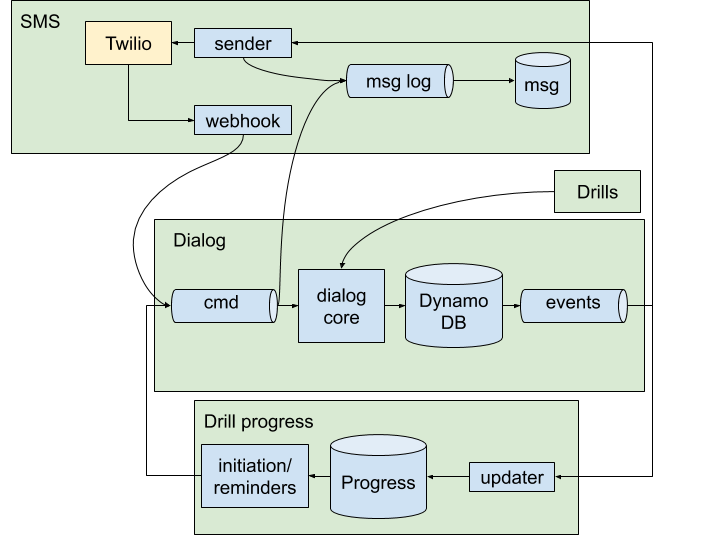

# Architecture

The system consists of four [bounded contexts](https://martinfowler.com/bliki/BoundedContext.html):

* **[Dialog](dialog.md)**: Manages a user’s progress through an individual drill.
* **[Drill progress](drill-progress.md)**: Tracks each user’s progress through all drills. Initiates new drills and sends reminders for incomplete drills.
* **[SMS](sms.md)**: Sends and receives SMS messages via Twilio.
* **[Drills](drills.md)**: Contains drill content, including list of questions to ask, correct answers, and translations into several languages.

*Data flow, illustrating 4 bounded contexts: Dialog, SMS, Drills, and Drill Progress. Some components omitted for clarity.*

These four bounded contexts are eventually consistent with each other and they communicate over narrowly defined interfaces:

* **Dialog commands Kinesis stream**. The dialog context receives one of three commands here. Process SMS commands are enqueued by the SMS context. Trigger Reminder and Start Drill commands are enqueued by the Drill Progress context. The SMS context also consumes these commands so that it can log inbound messages from twilio.
* **Dialog events DynamoDB stream**. The dialog context emits events here. Those events are consumed by the SMS context, which translates them into outbound SMS messages. They are also consumed by the Drill Progress context, which updates information on who has completed which drills.
* **Drills API**. Retrieves a specific drill. Invoked synchronously from the dialog context.

## Scaling the system

The core scaling principle is that, for any phone number, each component can only do one thing at a time. We've sharded our kinesis streams and DynamoDB tables/streams by phone numbers and set parallelism to 1 to ensure that we aren't processing multiple commands/events at the same time. The SMS sending FIFO queue also defines message groups by phone number.

**If there is a bottleneck in the dialog engine**, we can increase throughput by adding shards to the Kinesis stream for dialog commands. That effectively will increase the number of dialog engines running in parallel.

**If there is a bottleneck in SMS sending**, we can increase the number of queue processors for the SMS sending queue. See [the SMS Context](sms.md) for more information.

**If there is a bottleneck in initiating drills on-demand**, either when the user first validates or when they type "MORE" to request a new drill, try to get any expensive queries of the Drill Progress DB off the critical path for those events. See the [updater](../stopcovid/drill_progress/aws_lambdas/update_drill_status.py) and the documentation on the [Drill Progress Context](drill-progress.md).

**Don't let any component do parallel processing for a phone number.** Each component makes assumption that no other instance of that component is working on that phone number at the same time. It is okay for different components (e.g., the Drill Status Context updater and the Dialog Context command handler) to be simultaneously be working on the same phone number.
