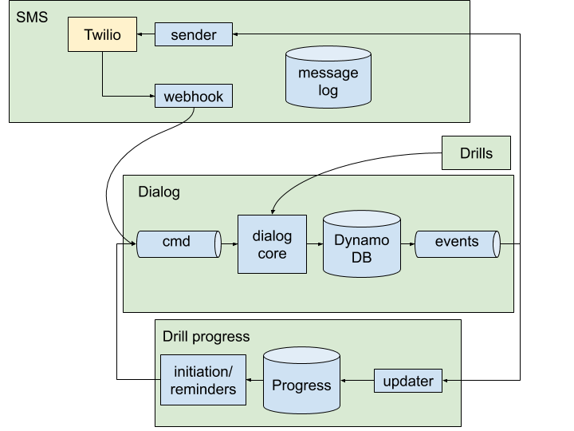

# Architecture

The system consists of four [bounded contexts](https://martinfowler.com/bliki/BoundedContext.html):

* **[Dialog](dialog.md)**: Manages a user’s progress through an individual drill.
* **[Drill progress](drill-progress.md)**: Tracks each user’s progress through all drills. Initiates new drills and sends reminders for incomplete drills.
* **[SMS](sms.md)**: Sends and receives SMS messages via Twilio.
* **[Drills](drills.md)**: Contains drill content, including list of questions to ask, correct answers, and translations into several languages.

*Data flow, illustrating 4 bounded contexts: Dialog, SMS, Drills, and Drill Progress. Some components omitted for clarity.*

These four bounded contexts are eventually consistent with each other and they communicate over narrowly defined interfaces:

* **Dialog commands Kinesis stream**. The dialog context receives one of three commands here. Process SMS commands are enqueued by the SMS context. Trigger Reminder and Start Drill commands are enqueued by the Drill Progress context. The SMS context also consumes these commands so that it can log inbound messages from twilio.
* **Dialog events DynamoDB stream**. The dialog context emits events here. Those events are consumed by the SMS context, which translates them into outbound SMS messages. They are also consumed by the Drill Progress context, which updates information on who has completed which drills.
* **Drills API**. Retrieves a specific drill. Invoked synchronously from the dialog context.