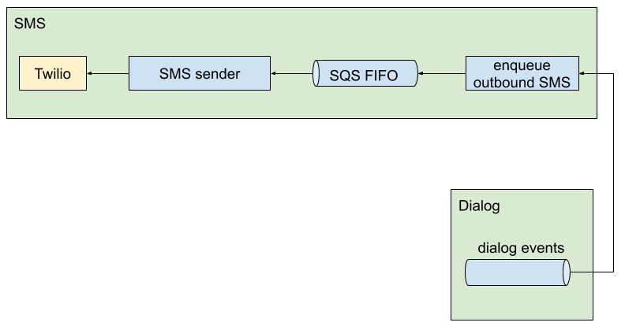

# SMS Context

The SMS Context is responsible for sending and receiving messages with users. It includes our integration with Twilio.

## Inbound SMS

Inbound messages are messages from users to the stopCOVID system. All inbound messages arrive in the system via the Twilio webhook. For each message, we enqueue a command in the Dialog Context's command queue to process the message.

## Outbound SMS

Outbound messages are messages from the stopCOVID system to users. Currently all outbound messages are triggered by events from the Dialog Context.

Our dialog event processor reads from the event stream and enqueues message sending commands to an SQS FIFO queue. Our "SMS sender" sends messages from that queue to Twilio.

We had two reasons for introducing an SQS queue:

* DynamoDB streams are effectively capped at two listening lambdas per shard.
* The SQS queue allows us to parallelize message sending more if we need o.

## Message logging

We maintain a log of SMS delivery events, both inbound and outbound, in a kinesis stream. We then write the contents of that stream to a SQL database for easy querying.

There are three types of messages, which we obtain in three different ways:

* `OUTBOUND_SMS`: Logged by our [SMS sender](../stopcovid/sms/aws_lambdas/send_sms_batch.py) after sending messages to Twilio.
* `INBOUND_SMS`: Logged by our [Inbound SMS logger](../stopcovid/sms/aws_lambdas/log_inbound_sms.py), which listens to the dialog command stream.
* `STATUS_UPDATE`: Logged by the [twilio webhook](../stopcovid/sms/aws_lambdas/twilio_webhook.py).

## Components

* [Twilio webhook](../stopcovid/sms/aws_lambdas/twilio_webhook.py): A lambda reachable via Amazon's API Gateway.
* [Event stream processor](../stopcovid/sms/aws_lambdas/enqueue_sms_batch.py) that enqueues commands to send SMS messages into an SQS FIFO queue.
* [SMS sender](../stopcovid/sms/aws_lambdas/send_sms_batch.py) that sends SMS commands to twilio.
* [Inbound SMS logger](../stopcovid/sms/aws_lambdas/log_inbound_sms.py) that listens to the dialog command stream and logs inbound SMS messages
* [Log persister](../stopcovid/sms/aws_lambdas/persist_logs.py) that records message log entries in a SQL database.